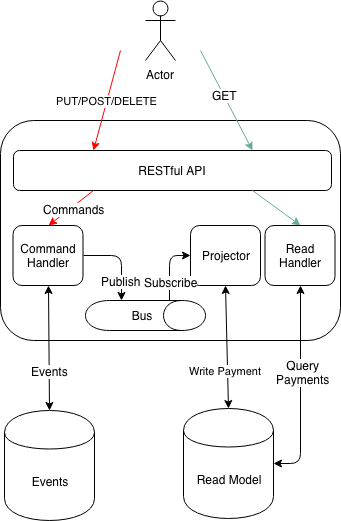

# Payments Service

Contoso requires a service to help with the processing of payments. This documents contain the high level design for the new **Payments API Service**.

*Date Created: 02/02/19*

## Requirements
There are a number of requirements that have been supplied that need to be taken into account with the design:

* A *RESTful* API should be exposed by the service that supports the following:
	*  Creating a new payment
	*  Updating an existing payment
	*  Deleting an existing payment
	*  Retrieving a payment
	*  Getting a list of payments
* All data should be persisted to a data store 

## Guiding Principles
There are a number of guiding principles that have influenced the design of the payments service:

* We want to keep a history of changes to payments
* Multiple versions of the service should be supported

Given a better understanding of the domain we'd change the API to better follow the [modelling advice by Thoughtworks](https://www.thoughtworks.com/insights/blog/rest-api-design-resource-modeling):

	* avoid creating an overly CRUDy API for payments
	* follow a **REST without PUT** approach
	* capture intent of a change to a payment
	
## Design

We will be following a CQRS with ES (event sourcing) approach with the events and read models stored in mongodb. CQRS with ES has been chosen so that we have a complete history of all the changes to a payment. To aid with the implementation we will us [Event Horizon](https://github.com/looplab/eventhorizon).

The general approach is that operations that mutate payments (create, update and delete) will be translated into commands in the HTTP handlers. And likewise, operations that query payments will query the read model.

This design is eventually consistent in there is a slight delay between an event being written to the event database and the read model being updated. In this first implementation we will be using an in-memory event bus. However in the future we will split the service into 2 parts (i.e. a payments query and a payments processor service) with Kafka.

We will follow a schema first approach when building the RESTful api. For the definition we will use OpenAPI 2 (a.k.a Swagger 2). Our service will have the following endpoints:

| Method | Path | Purpose |
| ---------- | ------ | ----------- |
| GET | /payments | Get a list of payments |
| GET | /payments/:paymentid | Get a single payment |
| PUT | /payments/:paymentid | Update a payment |
| DELETE | /payments/:paymentid | Delete a payment |
| GET | /ready | Signals the service is ready to accept requests |
| GET | /alive | Is the service alive |

We will generate boiler plate code from the OpenAPI definition so that we can focus on implementing the functionality of the endpoints. We will use [go-swagger](https://github.com/go-swagger/go-swagger) for this code generation.

## Future Work
A number of items are considered initially out of scope in this design but will be included in a future version:

* Concurrency (using ETags or some other method)
* API Versioning (using Content-Type header)
* Authentication
* Authorisation
* Rate limiting
* Deployment
* e2e tests
* metrics
